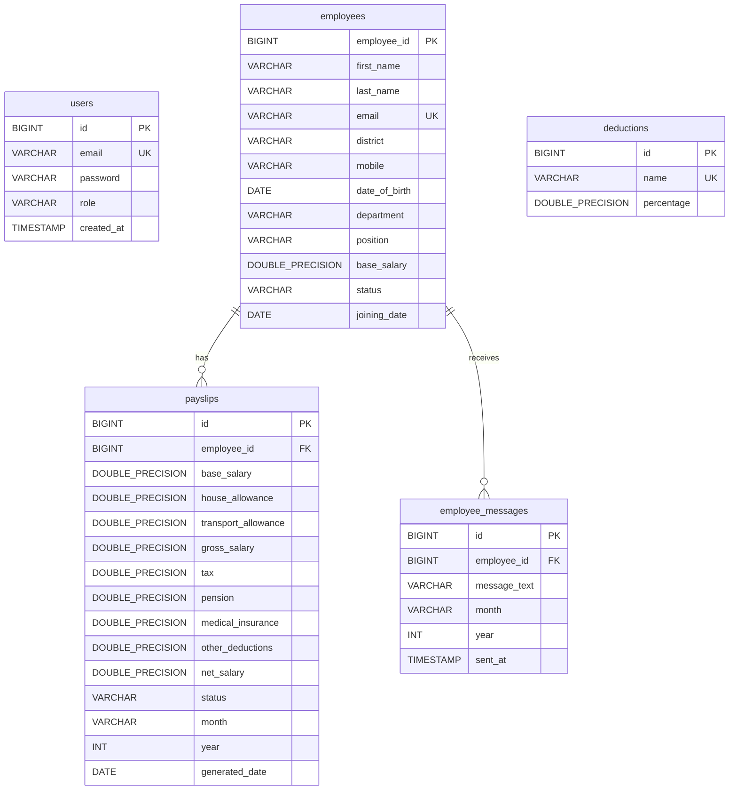
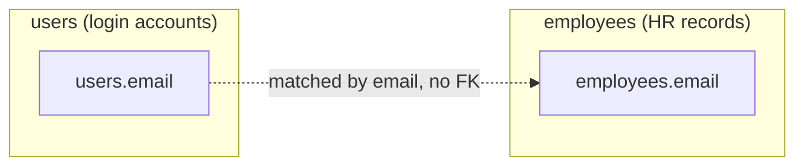
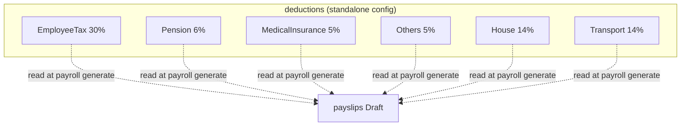
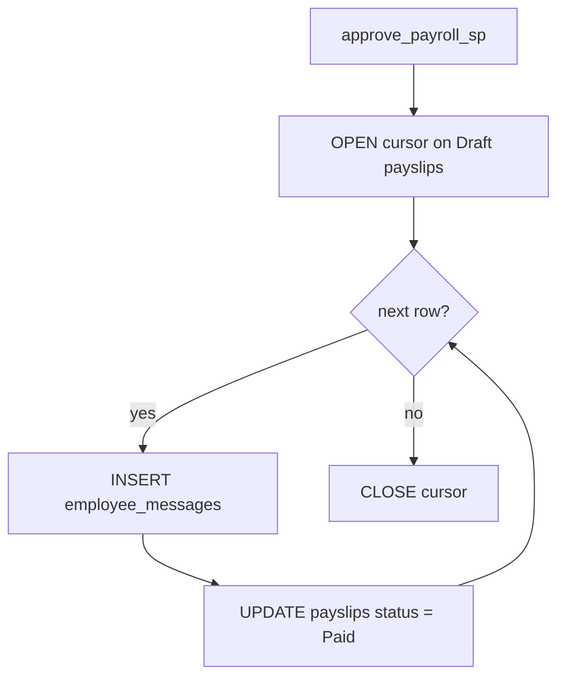

# Database Entity-Relationship Diagram

```mermaid
erDiagram
    users {
        BIGINT id PK
        VARCHAR email UK
        VARCHAR password
        VARCHAR role
        TIMESTAMP created_at
    }

    employees {
        BIGINT employee_id PK
        VARCHAR first_name
        VARCHAR last_name
        VARCHAR email UK
        VARCHAR district
        VARCHAR mobile
        DATE date_of_birth
        VARCHAR department
        VARCHAR position
        DOUBLE_PRECISION base_salary
        VARCHAR status
        DATE joining_date
    }

    payslips {
        BIGINT id PK
        BIGINT employee_id FK
        DOUBLE_PRECISION base_salary
        DOUBLE_PRECISION house_allowance
        DOUBLE_PRECISION transport_allowance
        DOUBLE_PRECISION gross_salary
        DOUBLE_PRECISION tax
        DOUBLE_PRECISION pension
        DOUBLE_PRECISION medical_insurance
        DOUBLE_PRECISION other_deductions
        DOUBLE_PRECISION net_salary
        VARCHAR status
        VARCHAR month
        INT year
        DATE generated_date
    }

    employee_messages {
        BIGINT id PK
        BIGINT employee_id FK
        VARCHAR message_text
        VARCHAR month
        INT year
        TIMESTAMP sent_at
    }

    deductions {
        BIGINT id PK
        VARCHAR name UK
        DOUBLE_PRECISION percentage
    }

    employees ||--o{ payslips : has
    employees ||--o{ employee_messages : receives
```

```mermaid
flowchart LR
    subgraph Auth["users (login accounts)"]
        U[users.email]
    end

    subgraph HR["employees (HR records)"]
        E[employees.email]
    end

    U -.->|matched by email, no FK| E
```

```mermaid
flowchart TD
  subgraph Config["deductions (standalone config)"]
        D1[EmployeeTax 30%]
        D2[Pension 6%]
        D3[MedicalInsurance 5%]
        D4[Others 5%]
        D5[House 14%]
        D6[Transport 14%]
    end

    D1 & D2 & D3 & D4 & D5 & D6 -.->|read at payroll generate| P[payslips Draft]
```

```mermaid
flowchart TD
    A[approve_payroll_sp] --> B[OPEN cursor on Draft payslips]
    B --> C{next row?}
    C -->|yes| D[INSERT employee_messages]
    D --> E[UPDATE payslips status = Paid]
    E --> C
    C -->|no| F[CLOSE cursor]
```
