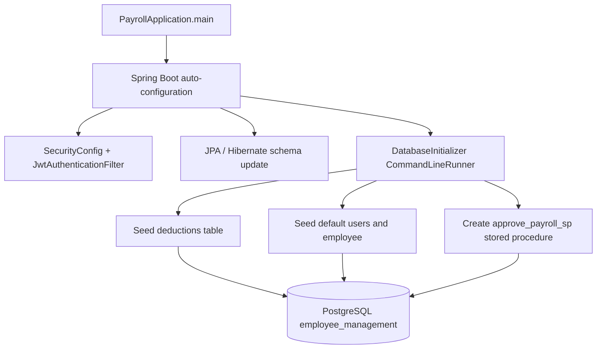
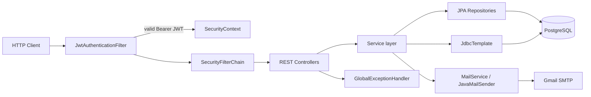
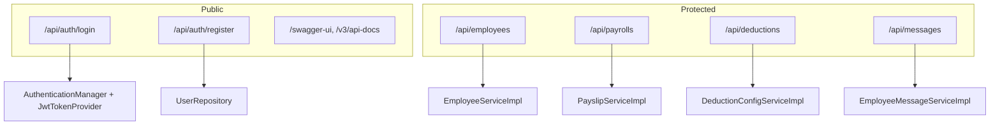
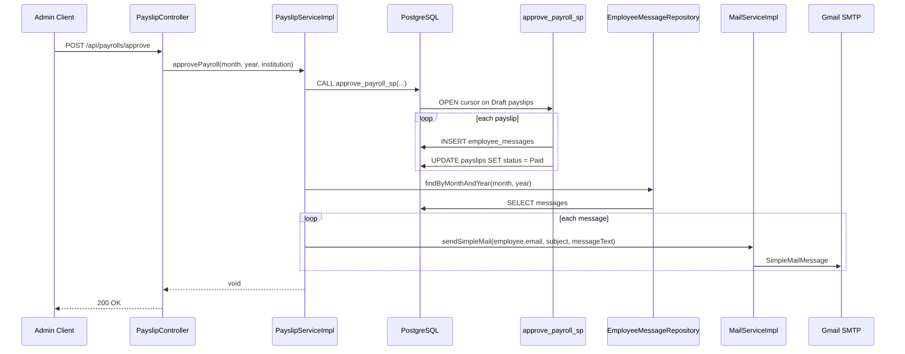
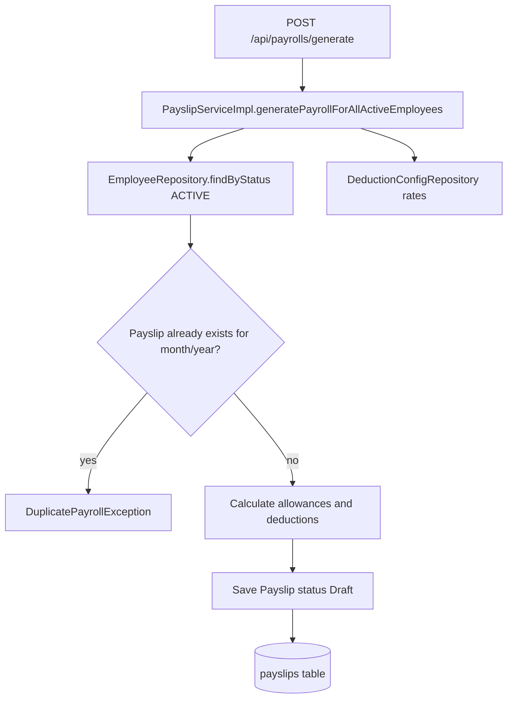
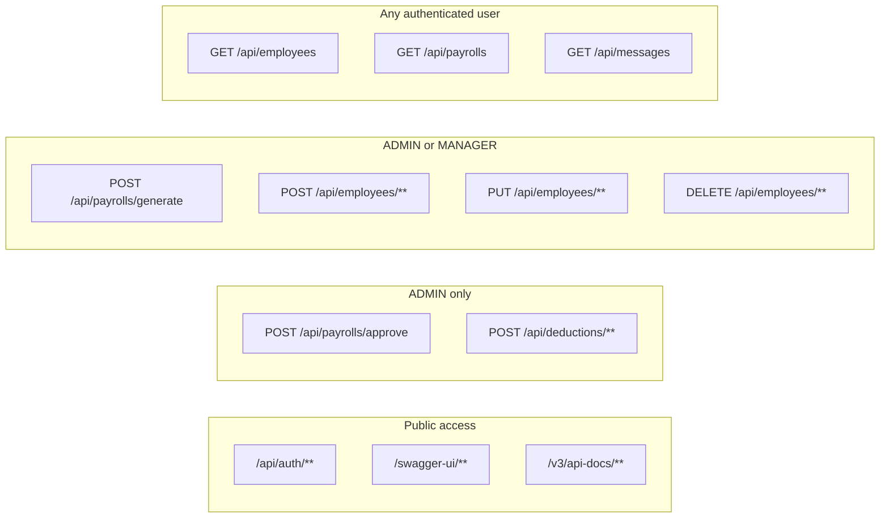

# Spring Boot Application Flow Diagram

```mermaid
flowchart TD
    A[PayrollApplication.main] --> B[Spring Boot auto-configuration]
    B --> C[SecurityConfig + JwtAuthenticationFilter]
    B --> D[JPA / Hibernate schema update]
    B --> E[DatabaseInitializer CommandLineRunner]

    E --> E1[Seed deductions table]
    E --> E2[Seed default users and employee]
    E --> E3[Create approve_payroll_sp stored procedure]

    E1 --> F[(PostgreSQL employee_management)]
    E2 --> F
    E3 --> F
```

```mermaid
flowchart LR
    Client[HTTP Client] --> Filter[JwtAuthenticationFilter]
    Filter -->|valid Bearer JWT| Security[SecurityContext]
    Filter --> Chain[SecurityFilterChain]
    Chain --> Controller[REST Controllers]
    Controller --> Service[Service layer]
    Service --> Repo[JPA Repositories]
    Service --> JDBC[JdbcTemplate]
    Repo --> DB[(PostgreSQL)]
    JDBC --> DB
    Service --> Mail[MailService / JavaMailSender]
    Mail --> SMTP[Gmail SMTP]
    Controller --> Handler[GlobalExceptionHandler]
```

```mermaid
flowchart TB
    subgraph Public
        Auth["/api/auth/login"]
        Reg["/api/auth/register"]
        Swagger["/swagger-ui, /v3/api-docs"]
    end

    subgraph Protected
        Emp["/api/employees"]
        Pay["/api/payrolls"]
        Ded["/api/deductions"]
        Msg["/api/messages"]
    end

    Auth --> AuthSvc[AuthenticationManager + JwtTokenProvider]
    Reg --> UserRepo[UserRepository]

    Emp --> EmpSvc[EmployeeServiceImpl]
    Pay --> PaySvc[PayslipServiceImpl]
    Ded --> DedSvc[DeductionConfigServiceImpl]
    Msg --> MsgSvc[EmployeeMessageServiceImpl]
```

```mermaid
sequenceDiagram
    participant Admin as Admin Client
    participant PC as PayslipController
    participant PS as PayslipServiceImpl
    participant DB as PostgreSQL
    participant SP as approve_payroll_sp
    participant MR as EmployeeMessageRepository
    participant MS as MailServiceImpl
    participant SMTP as Gmail SMTP

    Admin->>PC: POST /api/payrolls/approve
    PC->>PS: approvePayroll(month, year, institution)
    PS->>DB: CALL approve_payroll_sp(...)
    DB->>SP: OPEN cursor on Draft payslips
    loop each payslip
        SP->>DB: INSERT employee_messages
        SP->>DB: UPDATE payslips SET status = Paid
    end
    PS->>MR: findByMonthAndYear(month, year)
    MR->>DB: SELECT messages
    loop each message
        PS->>MS: sendSimpleMail(employee.email, subject, messageText)
        MS->>SMTP: SimpleMailMessage
    end
    PS-->>PC: void
    PC-->>Admin: 200 OK
```

```mermaid
flowchart TD
    A[POST /api/payrolls/generate] --> B[PayslipServiceImpl.generatePayrollForAllActiveEmployees]
    B --> C[EmployeeRepository.findByStatus ACTIVE]
    B --> D[DeductionConfigRepository rates]
    C --> E{Payslip already exists for month/year?}
    E -->|yes| X[DuplicatePayrollException]
    E -->|no| F[Calculate allowances and deductions]
    F --> G[Save Payslip status Draft]
    G --> H[(payslips table)]
```

```mermaid
flowchart LR
    subgraph Public["Public access"]
        P1["/api/auth/**"]
        P2["/swagger-ui/**"]
        P3["/v3/api-docs/**"]
    end

    subgraph AdminOnly["ADMIN only"]
        A1["POST /api/payrolls/approve"]
        A2["POST /api/deductions/**"]
    end

    subgraph AdminManager["ADMIN or MANAGER"]
        M1["POST /api/payrolls/generate"]
        M2["POST /api/employees/**"]
        M3["PUT /api/employees/**"]
        M4["DELETE /api/employees/**"]
    end

    subgraph Authenticated["Any authenticated user"]
        U1["GET /api/employees"]
        U2["GET /api/payrolls"]
        U3["GET /api/messages"]
    end
```
